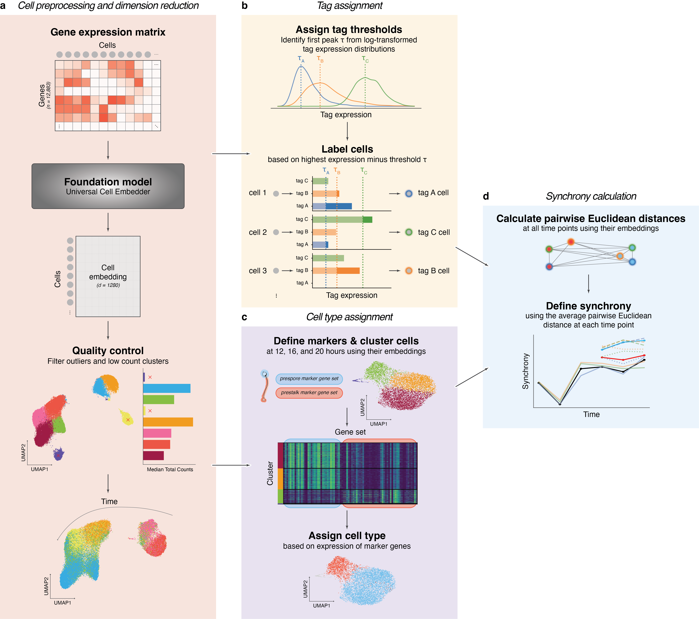

## Analysis of Single-Cell RNA-Seq Data from *Dictyostelium discoideum*

### Overview

This repository provides a comprehensive analysis pipeline for single-cell RNA sequencing (scRNA-seq) data generated from *Dictyostelium discoideum*. The pipeline is designed to analyze both wild-type and mutant strains, focusing on the following key aspects:

* **Quality Control** of raw sequencing reads
* **Dimensionality Reduction** ([UCE](https://github.com/snap-stanford/UCE?tab=readme-ov-file) embedder, UMAP)
* **Clustering** and **Cell-Type Annotation**
* **Synchrony** analysis of cell populations

This project is designed to be modular and reproducible, with clear separation of data processing, analysis logic, and visualization.

### Table of Contents

1. [Installation](#installation)
2. [Data Sources](#data-sources)
3. [Directory Structure](#directory-structure)
4. [Usage](#usage)
5. [Analysis Workflow](#analysis-workflow)
6. [Results](#results)

---

### Installation

1. **Clone the repository**

   ```bash
   git clone https://github.com/lenatr99/scRNA_dicty.git
   cd scRNA_dicty
   ```
2. **Create and activate the Conda environment**

   ```bash
   conda env create -f environment.yml
   conda activate scRNA_env
   ```

### Data Sources

* **Wild-type (*AX4*)** scRNA-seq: TBD
* ***acaA<sup>-</sup>*** scRNA-seq: TBD
* ***acaA<sup>-</sup>pkaC<sup>OE</sup>*** scRNA-seq: TBD

### Directory Structure

```
├── data/
│   ├── raw/              # 10x Genomics raw data
│   ├── processed/        # Filtered data
│   └── other/            # Other data files (e.g., metadata)
├── notebooks/            # Jupyter notebooks for each step
├── results/
│   ├── figures/          # High-resolution plots (.png/.pdf)
│   └── other/            # Tables, lists, and summary files
├── src/                  # Custom Python modules and functions
├── environment.yml       # Conda specification
└── README.md             # Project overview
```

### Usage

Run the notebooks in order to reproduce the full analysis:

1. **01\_quality\_control.ipynb**: Import raw counts, perform QC, filter low-quality cells.
3. **02\_analysis.ipynb**: The complete analysis pipeline, including dimensionality reduction, clustering, cell-type annotation, and visualization.
5. **03\_synchronicity.ipynb**: Analyze the synchrony of cell populations.

Each notebook uses functions from `src/` to ensure consistency and reproducibility.

### Analysis Workflow




### Results

* **Figures**: High-quality UMAP plots, synchrony plots in `results/figures/`
* **Other**: Summaries and tables in `results/other/`

*Last updated: May 23, 2025*
